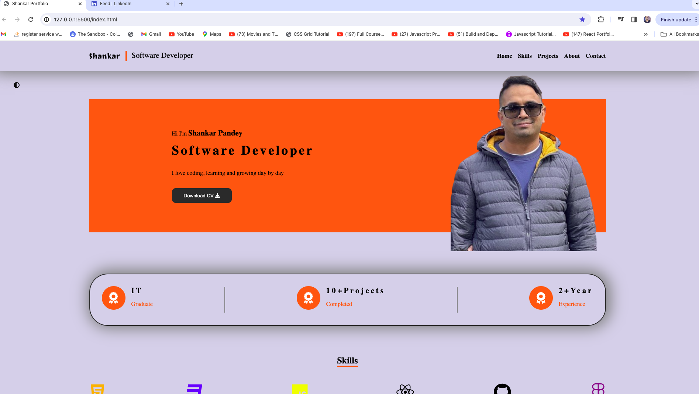

<!-- # React + Vite

This template provides a minimal setup to get React working in Vite with HMR and some ESLint rules.

Currently, two official plugins are available:

- [@vitejs/plugin-react](https://github.com/vitejs/vite-plugin-react/blob/main/packages/plugin-react/README.md) uses [Babel](https://babeljs.io/) for Fast Refresh
- [@vitejs/plugin-react-swc](https://github.com/vitejs/vite-plugin-react-swc) uses [SWC](https://swc.rs/) for Fast Refresh -->

## Portfolio Website

    This is my portfolio website repository, this will show my professional journey, skills and projects, this website designed to provide a comprehensive overview of my work and accomplishments in web development.



## Table of Contents

- [Introduction](#introduction)
- [Features](#features) -[Technologies](#technologies) -[How to Use](#how-to-use) -[Usage](#usage) -[Project structure](#project-structure) -[Contribution](#contribution) -[Licensing](#licensing) -[Contact](#contact)

## Introduction

serves as a digital resume and project showcase, reflecting my skills and experience as web developer.
It has various sections of bio, skills, projects, contact information and blog where my thoughts and insights are shared.
[My PortFolio] (https://shankarpandey.com)

## Features

- **Responsive Designs**: Optimized for all devices including desktops, tablets, and mobile phones
- **Single Page App**: Uses single page application structure, codebase for the multi- page is not deployed but the code is available in 'mpa',

## Technologies

- **Front End**:

  - HTML 5
    -CSS3
    -BOOTSTRAP
    -REACT JS

- **Deployment**:
  -Vercel
  -NameCheap

## How to Use (Installation)

To set up the project in your device locally please go through the following steps

1. **Clone the repository**:
   run the following command in your terminal
   ```
    git clone https://github.com/shankarpandey7230/reactPortfolio.git
   ```
2. **Navigate inside the project directory**:
   cd reactPortfolio
3. **Install all Dependencies** :

```
   yarn
```

4. **Run the development server**

```
    yarn dev
```

Note: if yarn is not used install it globally. Command to install `npm i yarn -g`

## Usage

## Project Structure

    reactportfolio
    |--public
    |--src
    |  |--components
    |   |--About.jsx

## Contribution

    There are many different ways to contribute to this project. If you are interested check out our contribution guidelines to learn how you can get involved.

## Licensing

## Contact

If you have any questions feel free to reach me out at
Email: shankarpandey7230@gmail.com
LinkedIn:https://www.linkedin.com/in/shankar-pandey/

Thank you for visiting my repo and any feedback are highly appreciated.
